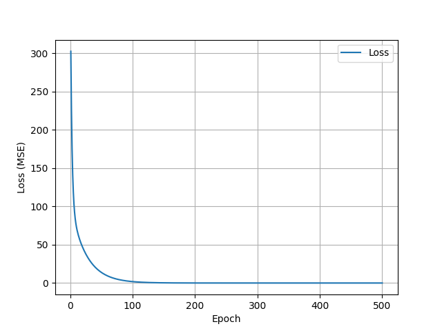
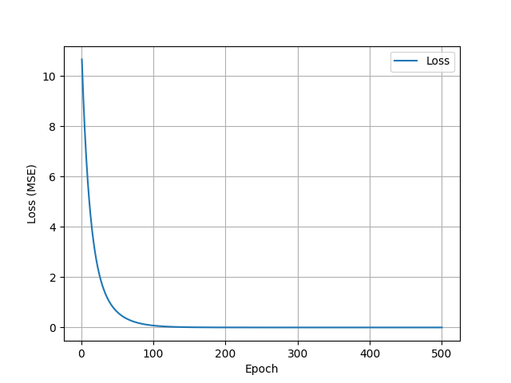

# My Notes

This is my personal notebook place, where I keep notes of the information I gain from books, papers, YouTube, GitHub, or the internet.

---

## Linear Regression

Linear regression is a great starting point for learning about artificial neurons and training processes. I found an excellent tutorial at:  
🔗 [https://github.com/johnnycode8/basic_neural_network](https://github.com/johnnycode8/basic_neural_network)  
This explanation is based on that tutorial.

---

### 📌 Neuron Node as a Linear Model

Imagine we have a model of a neuron node as shown below:  


It represents the linear equation:  
\[
Y = wX + b
\]
where:
- \( X \) is the input
- \( w \) is the weight
- \( b \) is a constant (bias)
- \( Y \) is the output of the neuron

So our predictor function becomes:
\[
\hat{y} = wX + b
\]

---

### 🧪 Example

Given:
- \( X = [-2, -1, 1, 2] \)
- \( w = 1.0 \), \( b = 0 \)

Then the output:
\[
Y = [-2, -1, 1, 2]
\]


---

### 🔧 The Regression Problem

In linear regression, our task is to **find the optimal values of \( w \) and \( b \)**, given \( X \) and the expected output \( Y \).

We start with **random initial values** for \( w \) and \( b \).  
For simplicity, let’s initialize:
- \( b = 0 \)
- \( w = 10 \)

This gives:
\[
\hat{y} = [-20, -10, 10, 20]
\]


Now we need a way to **update \( w \) and \( b \)** so that \( \hat{y} \) moves closer to the original \( Y \).

---

### 📉 Defining a Loss Function

We use **Mean Squared Error (MSE)** as the loss function:
```
loss = (1 / n) * sum((Y - Y_predicted)^2)
```

In NumPy:
```python
loss = ((Y - y_predicted) ** 2).mean()
```

Let’s visualize the loss for different weight values:
```python
W = [-0.5, 0, 0.5, 1.5, 2, 2.5]
```


From the plot, we observe that:
- Loss is minimized when \( w \approx 1 \)

But what if we start at \( w = 2.5 \) or \( w = -0.5 \)?  
They give similar loss values, but we need a direction to move toward \( w = 1 \).

---

### 🧭 Using the Gradient
First, let’s calculate the slope at each loss point. To do this, we can predict \( y \) around the weight point \( w \). Let’s define a small delta \( h = 0.01 \) for the numerical derivative.

Next, calculate the predicted values at \( w - h \) and \( w + h \). Then compute the losses \( L_{plus} \) and \( L_{minus} \).

Now we are ready to calculate the slope as:

```python
slope = (L_plus - L_minus) / (2 * h)
``` 
The Figure below shows a plot of these slope lines for the loss around each w point. On the left side of w=1, slope has negative value; on the right side, the slope has a positve value. At w=1, it has a zero value, which would be a line parallel to the x-axis if plotted. The slope gives us an idea of the direction we need to move w rom a given point to minimize the loss.

The gradient tells us the direction in which the loss increases.  
If we compute the **gradient of the loss w.r.t. \( w \)**, we can move in the opposite direction to minimize it.
#### Analytical derivative
Lets calculate teh derivative of loss function w.r.t. **w**
Our original prediction function is 
```python
ŷ = w.x + b
```
Loss (MSE) is:
```python
L = 1/n∑(y_i - ŷ_i)^2

```
```python
L = 1/n∑(y_i - (w.x_i + b))^2
```
Derivative of Loss w.r.t **w**:
```python
∂L/∂W = 1/n∑2(y_i - ŷ_i).(-x_i)
```
Or equivalently:
```python
∂L/∂W = 2/n∑x_i(ŷ_i - y_i)
```

We use:
```python
dw = np.dot(2 * X, y_predicted - Y).mean()
```

This gives the slope of the loss at the current point.  
By applying a **learning rate**, we can control how big the step is in each update.


---

### 🏋️ Training the Model

Now we can begin training by:
1. Initializing \( w \) and \( b \)
2. Repeating for a number of epochs:
   - Compute predicted output
   - Compute gradients
   - Update weights

```python
w -= learning_rate * dw
b -= learning_rate * db
```
Eventually, \( w \) and \( b \) will converge to values that minimize the loss. Figure below shows loss over epochs plot.



This method is called **gradient descent**.

---

### 🧠 Summary: Linear Regression Steps

- ✅ Define prediction function: \( y = wX + b \)
- ⚙️ Initialize weights and bias
- 📉 Define loss function (MSE)
- 📐 Compute gradient of loss
- 🧪 Set learning rate
- 🔁 Loop over epochs:
  - Predict output
  - Calculate loss
  - Calculate gradients
  - Update parameters

This process lays the foundation for training more complex neural networks.

---

## Autograd
### What is Autograd?
Autograd stands for **automatic differentiation**. It is a technique used by machine learning frameworks (like PyTorch, TensorFlow, JAX) **to automatically compute derivatives (gradients)** of functions — without us having to manually derive and implement the math ourself.

### Why do we need Autograd?
In machine learning, especially neural networks and optimization, we often need gradients of loss functions with respect to parameters to perform **gradient descent**.

- For complex models, calculating derivatives by hand is tedious and error-prone.

- Autograd automates this process so we can focus on building models.
### How does autograd work?
Autograd uses two main concepts:

#### 1. Computational Graph
When we perform operations on tensors/variables with requires_grad=True, autograd builds a graph of all operations.

Nodes represent operations; edges represent data dependencies.

#### 2. Chain Rule
To compute derivatives, autograd applies the chain rule of calculus by traversing this graph backward.

This process is called **backpropagation**.

PyTorch, Tensorflow, JAX are some of teh libraries which supports autograd.
### A simple example (PyTorch):
```python
import torch

x = torch.tensor(2.0, requires_grad=True)
y = x**2 + 3*x + 5  # y = x^2 + 3x + 5

y.backward()  # Compute dy/dx automatically

print(x.grad)  # prints 7, since dy/dx = 2x + 3 at x=2 => 2*2 +3 = 7
```
Here:

- PyTorch tracked all operations on x.

- When we call y.backward(), it computes gradient dy/dx.

- Gradient stored in x.grad.

### Key points:
- We only need to declare which tensors require gradients (requires_grad=True).

- After running the forward pass (computations), call .backward() on a scalar loss to compute gradients.

- Gradients are accumulated in .grad attributes of tensors.

- We usually zero gradients after each step (e.g., optimizer.zero_grad() or x.grad.zero_()).

### How autograd helps training models?
- We define your model and loss function.

- Autograd computes gradients automatically.

- We update parameters using gradients and a learning rate (gradient descent).

- Repeat until convergence.

### TensorFlow
```python
import tensorflow as tf
x = tf.Variable(2.0)
with tf.GradientTape() as tape:
    y = x**2 + 3*x + 1
dy_dx = tape.gradient(y, x)
print(dy_dx)  # 7.0
```

### JAX
```python
import jax
import jax.numpy as jnp
def f(x): return x**2 + 3*x + 1
df_dx = jax.grad(f)
print(df_dx(2.0))  # 7.0
```

## Linear regression using PyTorch
Now let's implement linear regression using PyTorch and autograd, without calculating the gradient ourselves.  
We define the input `X` as a torch tensor:
```python
X = torch.tensor([-2, -1, 1, 2], dtype=torch.float32)
```
Then we calculate the original output Y with original weight **w = 1** and **b = 0**:
```python
Y = W_original * X + B_Original  # Y = wx + b
```
Now we need to instruct PyTorch's autograd to calculate the gradient of the loss function w.r.t both **w** and **b**. 
We initialize both **w** and **b** as follows:
```python
# Initialize parameters with gradient tracking
w = torch.randn((), requires_grad=True)  # scalar weight
b = torch.randn((), requires_grad=True)  # scalar bias
```
Now PyTorch will track all operations on **w** and **b**.

Let's define the foreward pass function:
```python
# Forward pass function
def forward(x, w, b):
    return w * x + b 
```
And loss function:
```python
# Loss function (Mean Squared Error)
def loss(y_true, y_pred):
    return ((y_true - y_pred) ** 2).mean()
```
Now whenever we calculate the loss function and then call **backward()** on that value, PyTorch will compute the gradients of the loss function w.r.t the gradient-enabled variables (in this case **∂L/∂w** and **∂L/∂b**) and store the corresponding gradients in **w.grad** and **b.grad**:
```python
# Calculate loss
l = loss(Y, y_predicted)
l.backward()  # Compute gradients
# gradients: ∂L/∂w = w.grad and ∂L/∂b = b.grad
```
The rest of the gradient descent code is the same:
```python
# Training loop     
for epoch in range(epochs):
    # Forward pass
    y_predicted = forward(X, w, b)
    
    # Calculate loss
    l = loss(Y, y_predicted)
    losses.append(l.item())
    
    # Backward pass
    l.backward()  # Compute gradients
    
    # Update parameters
    with torch.no_grad():
        w -= learning_rate * w.grad
        b -= learning_rate * b.grad
    
    # Zero gradients for the next iteration
    w.grad.zero_()
    b.grad.zero_()
    
    if (epoch + 1) % 10 == 0:
        print(f'Epoch {epoch + 1}: w={w.item():.3f}, b={b.item():.3f}, loss={l.item():.8f}')
```


[View full code](./liniear_regression/lr_pytorch.py)
