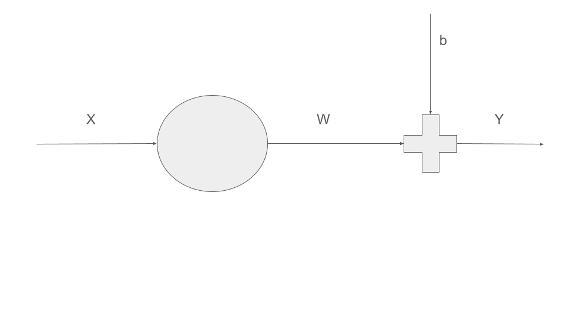
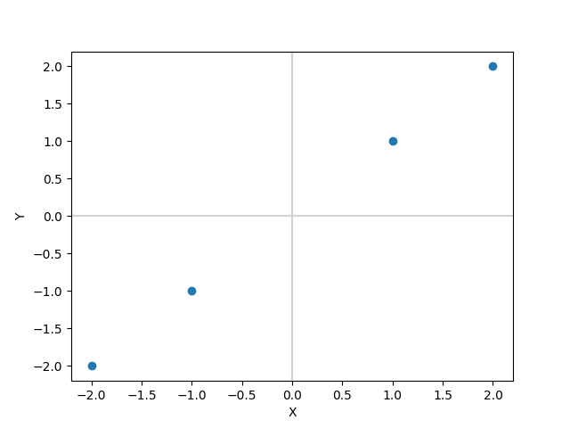
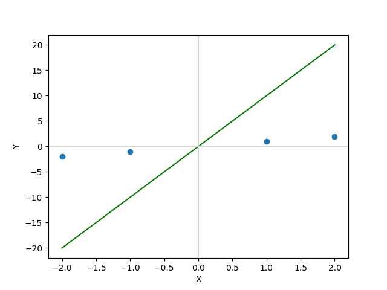
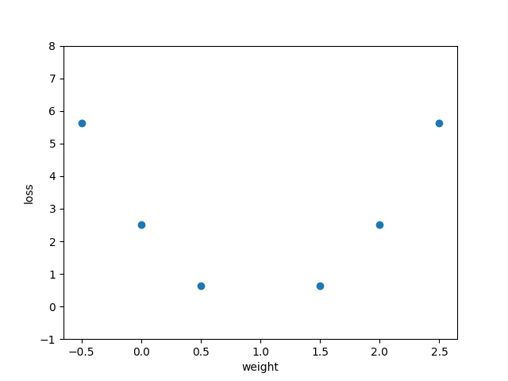
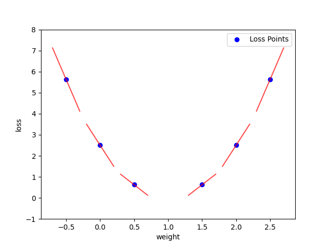
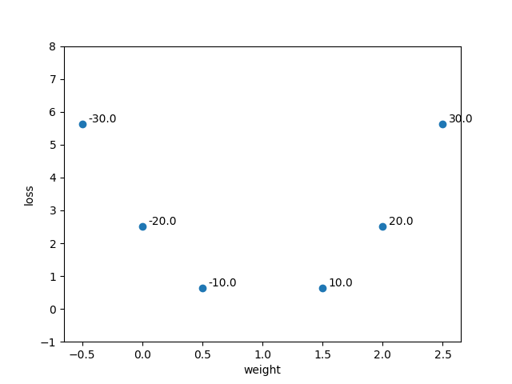

# My Notes

This is my personal notebook place, where I keep notes of the information I gain from books, papers, YouTube, GitHub, or the internet.

---

## Linear Regression

Linear regression is a great starting point for learning about artificial neurons and training processes. I found an excellent tutorial at:  
🔗 [https://github.com/johnnycode8/basic_neural_network](https://github.com/johnnycode8/basic_neural_network)  
This explanation is based on that tutorial.

---

### 📌 Neuron Node as a Linear Model

Imagine we have a model of a neuron node as shown below:  


It represents the linear equation:  
\[
Y = wX + b
\]
where:
- \( X \) is the input
- \( w \) is the weight
- \( b \) is a constant (bias)
- \( Y \) is the output of the neuron

So our predictor function becomes:
\[
\hat{y} = wX + b
\]

---

### 🧪 Example

Given:
- \( X = [-2, -1, 1, 2] \)
- \( w = 1.0 \), \( b = 0 \)

Then the output:
\[
Y = [-2, -1, 1, 2]
\]



---

### 🔧 The Regression Problem

In linear regression, our task is to **find the optimal values of \( w \) and \( b \)**, given \( X \) and the expected output \( Y \).

We start with **random initial values** for \( w \) and \( b \).  
For simplicity, let’s initialize:
- \( b = 0 \)
- \( w = 10 \)

This gives:
\[
\hat{y} = [-20, -10, 10, 20]
\]



Now we need a way to **update \( w \) and \( b \)** so that \( \hat{y} \) moves closer to the original \( Y \).

---

### 📉 Defining a Loss Function

We use **Mean Squared Error (MSE)** as the loss function:
```
loss = (1 / n) * sum((Y - Y_predicted)^2)
```

In NumPy:
```python
loss = ((Y - y_predicted) ** 2).mean()
```

Let’s visualize the loss for different weight values:
```python
W = [-0.5, 0, 0.5, 1.5, 2, 2.5]
```



From the plot, we observe that:
- Loss is minimized when \( w \approx 1 \)

But what if we start at \( w = 2.5 \) or \( w = -0.5 \)?  
They give similar loss values, but we need a direction to move toward \( w = 1 \).

---

### 🧭 Using the Gradient
First, let’s calculate the slope at each loss point. To do this, we can predict \( y \) around the weight point \( w \). Let’s define a small delta \( h = 0.01 \) for the numerical derivative.

Next, calculate the predicted values at \( w - h \) and \( w + h \). Then compute the losses \( L_{plus} \) and \( L_{minus} \).

Now we are ready to calculate the slope as:

```python
slope = (L_plus - L_minus) / (2 * h)
``` 
The Figure below shows a plot of these slope lines for the loss around each w point. On the left side of w=1, slope has negative value; on the right side, the slope has a positve value. At w=1, it has a zero value, which would be a line parallel to the x-axis if plotted. The slope gives us an idea of the direction we need to move w rom a given point to minimize the loss.

The gradient tells us the direction in which the loss increases.  
If we compute the **gradient of the loss w.r.t. \( w \)**, we can move in the opposite direction to minimize it.
#### Analytical derivative
Lets calculate teh derivative of loss function w.r.t. **w**
Our original prediction function is 
```
ŷ = w.x + b
```
Loss (MSE) is:
```
L = 1/n∑(y_i - ŷ_i)^2

```
```
L = 1/n∑(y_i - (w.x_i + b))^2

```
Derivative of Loss w.r.t **w**:
```
∂L/∂W = 1/n∑2(y_i - ŷ_i).(-x_i)
```
Or equivalently:
```
∂L/∂W = 2/n∑x_i(ŷ_i - y_i)
```

We use:
```python
dw = np.dot(2 * X, y_predicted - Y).mean()
```

This gives the slope of the loss at the current point.  
By applying a **learning rate**, we can control how big the step is in each update.



---

### 🏋️ Training the Model

Now we can begin training by:
1. Initializing \( w \) and \( b \)
2. Repeating for a number of epochs:
   - Compute predicted output
   - Compute gradients
   - Update weights

```python
w -= learning_rate * dw
b -= learning_rate * db
```

Eventually, \( w \) and \( b \) will converge to values that minimize the loss.

---

### 🧠 Summary: Linear Regression Steps

- ✅ Define prediction function: \( y = wX + b \)
- ⚙️ Initialize weights and bias
- 📉 Define loss function (MSE)
- 📐 Compute gradient of loss
- 🧪 Set learning rate
- 🔁 Loop over epochs:
  - Predict output
  - Calculate loss
  - Calculate gradients
  - Update parameters

This process lays the foundation for training more complex neural networks.
