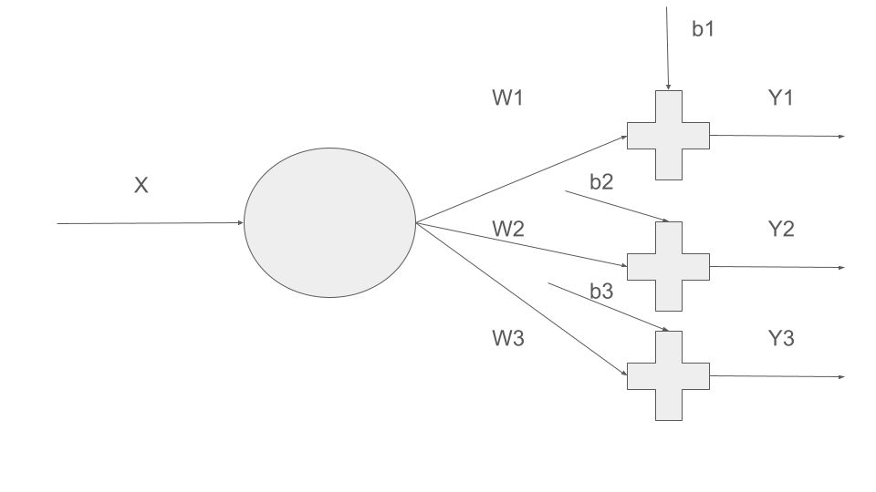
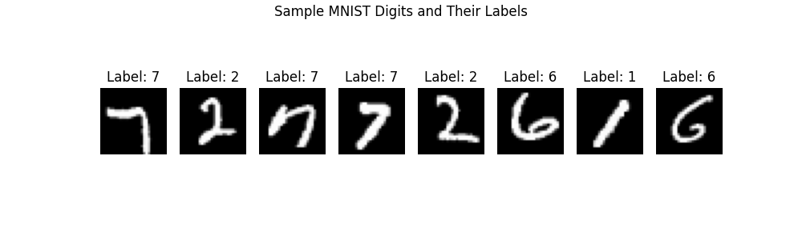

# Multiclass Classification
In the case of linear regression, we did not use any activation function, because we did not have to squash outputs to 0-1 range. In the case of Logic regression, we used Sigmoid activation function to squash the outputs to 0-1 range and if the value > 0.5, considered as Class 1 and otherwise Class 0. 
### Softmax
$Softmax(z_i) = \frac{e^{z_i}} {\sum_{j=1}^{K} e^{z_j}}$	
- Input: a vector of logits $[z_1, z_2, ..., z_K]$
- Output: a probability distribution over K classes

Ensures:
- All outputs $\in (0, 1)$
- Sum of all outputs = 1

Imagine a 3 class case, where negative numbers are classified as 0, positive numbers 2 and 0 as 1. 
Assume we have inputs:
```python
X = torch.tensor([[-2.0], [0.0], [1.0]])
```
and corresponding labels
```python
Y = torch.tensor([0, 1, 2]) 
```

Now we have a forward pass defined as:
```python
def forward(x):
    logits = x @ w + b  # shape: [batch, 3]
    return logits  # softmax will be applied in loss
```

### Cross-Entroly Loss
Softmax is used with CrossEntropyLoss function.
```python
#  CrossEntropyLoss (manual)
def cross_entropy_loss(logits, labels):
    # logits: [batch, num_classes], labels: [batch]
    # Apply softmax
    max_logits = torch.max(logits, dim=1, keepdim=True).values  # for stability
    exp_logits = torch.exp(logits - max_logits)
    softmax_probs = exp_logits / exp_logits.sum(dim=1, keepdim=True)

    # Pick log prob of correct class
    batch_indices = torch.arange(len(labels))
    correct_probs = softmax_probs[batch_indices, labels]

    loss = -torch.log(correct_probs + 1e-8).mean()
    return loss
```

with the given value of $X$, assume the softmax probs calculated is
```python
softmax_probs = [
    [0.1, 0.2, 0.7], # for -2.0
    [0.8, 0.3, 0.1], # for 0.0
    [0.3, 0.2, 0.5]  # for 1.0
]
labels = [0, 1, 2]
correct_probs = [0.1, 0.3, 0.5]
```
#### Final Cross-Entropy Loss
```python
    loss = -torch.log(correct_probs + 1e-8).mean()
```
- Take log of the correct class probabilities.
- Add small 1e-8 to avoid log(0) (which is -inf)
- Multiply by -1 (because log-likelihood is negative)
- Then take the mean across the batch.

## 3 Class classification

Now let's do a 3 class classification (labels: 0, 1, 2), where negative numbers are classified as 0, number 0 is classified as 1 and positive numbers are classified as 2.

After a successfull training, we should get a very high value on Y1 output for negative numbers as compared to Y2 and Y3. For 0 input, high value on Y2 and for positive value high value on Y3.

[View full code](./threeclass.py)

[View full code with Pytorch simplification](./multiclass_simple.py)


## Classify digits 0-9 using **softmax**
Here, we will use MNIST data set. MNIST is a dataset of 70,000 grayscale images of handwritten digits (0 to 9):
- 60,000 for training
- 10,000 for testing

Each image is:
- Size: 28x28 pixels
- Format: Grayscale (each pixel is a value from 0 to 255)




### Cross EntropyLoss function


